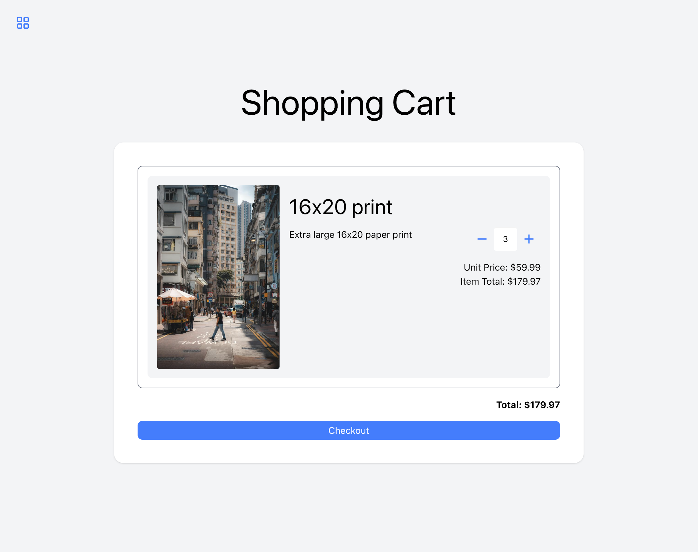
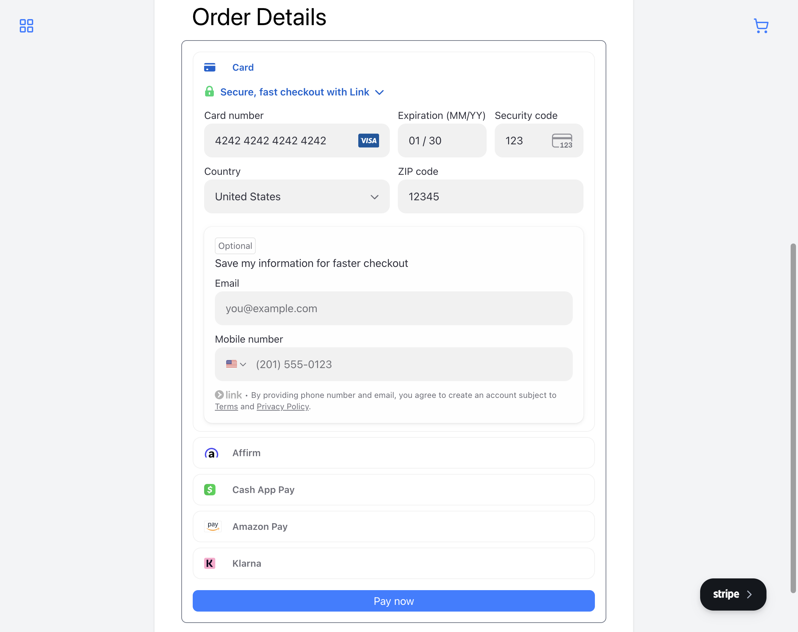

# Photoview Demo

A React TypeScript frontend for the Photoview photo marketplace API, demonstrating the complete e-commerce user flow from browsing to checkout.

## Demo

[Live Demo](https://photoview.annikaharmsen.com/)

### Screenshots

| Login                      | Gallery                        | Purchase Options                                 |
| -------------------------- | ------------------------------ | ------------------------------------------------ |
|  |  |  |

| Cart                     | Shipping                         | Payment                        | Success                        |
| ------------------------ | -------------------------------- | ------------------------------ | ------------------------------ |
|  |  |  |  |

## Features

- User registration and authentication
- Photo gallery with optimized image loading
- Print format selection with pricing
- Shopping cart management
- Multi-step checkout with address form
- Stripe payment integration
- Real-time upload progress for large files

## Tech stack

- **React 19** with TypeScript for type-safe component development
- **Vite 7** for fast builds and hot module replacement
- **Tailwind CSS 4** with daisyUI for styling
- **React Router DOM 7** for client-side routing
- **Stripe React SDK** for payment form integration
- **react-hook-form** for form state management
- **lucide-react** for icons

## Installation

1. Clone the repository:

```bash
git clone https://github.com/annikaharmsen/photoview-demo.git
cd photoview-demo
```

2. Install dependencies:

```bash
npm install
```

3. Create environment file:

```bash
cp .env.example .env
```

4. Configure your `.env` file:

```env
VITE_API_URL=http://localhost/photoview/API/
VITE_WEB_URL=http://localhost:5173/
```

5. Start the development server:

```bash
npm run dev
```

## Project structure

```
src/
├── components/
│   ├── AddressForm.tsx       # Shipping address form
│   ├── Card.tsx              # Card container component
│   ├── DemoInfo.tsx          # Demo mode information
│   ├── FormGrid.tsx          # Form layout grid
│   ├── Link.tsx              # Styled link component
│   ├── NavBar.tsx            # Navigation bar
│   ├── QuantityInput.tsx     # Quantity selector
│   ├── StripePaymentForm.tsx # Stripe payment element
│   ├── app-buttons.tsx       # Application-specific buttons
│   ├── buttons.tsx           # Base button components
│   ├── cart-item.tsx         # Cart item display
│   ├── form-elements.tsx     # Form input components
│   └── headings.tsx          # Typography components
├── hooks/
│   ├── use-cart.tsx          # Cart state management
│   ├── use-fetch.tsx         # API fetch with auth handling
│   └── use-xhr.tsx           # XHR for file uploads with progress
├── layouts/
│   ├── AppLayout.tsx         # Main app layout with nav
│   ├── CenteredLayout.tsx    # Centered content layout
│   └── DemoLayout.tsx        # Demo-specific layout
├── pages/
│   ├── Cart.tsx              # Shopping cart page
│   ├── Checkout.tsx          # Checkout flow
│   ├── Complete.tsx          # Order confirmation
│   ├── Gallery.tsx           # Photo gallery
│   ├── Login.tsx             # Login form
│   ├── NotFound.tsx          # 404 page
│   ├── Purchase.tsx          # Format selection
│   ├── Register.tsx          # Registration form
│   ├── Upload.tsx            # Photo upload
│   └── Welcome.tsx           # Landing page
├── types/
│   └── app.d.ts              # TypeScript type definitions
├── App.tsx                   # Route configuration
└── main.tsx                  # Application entry point
```

## Custom hooks

### useFetch

Wrapper around fetch that handles authentication redirects and standardized error responses from the API.

### useXHR

XMLHttpRequest-based hook for file uploads, providing real-time progress tracking for large image uploads.

### useCart

Cart state management with methods for fetching items, updating quantities, and calculating totals.

## Scripts

| Command           | Description              |
| ----------------- | ------------------------ |
| `npm run dev`     | Start development server |
| `npm run build`   | Build for production     |
| `npm run preview` | Preview production build |
| `npm run lint`    | Run ESLint               |

## License

This project is licensed under the MIT License - see the [LICENSE](LICENSE) file for details.
